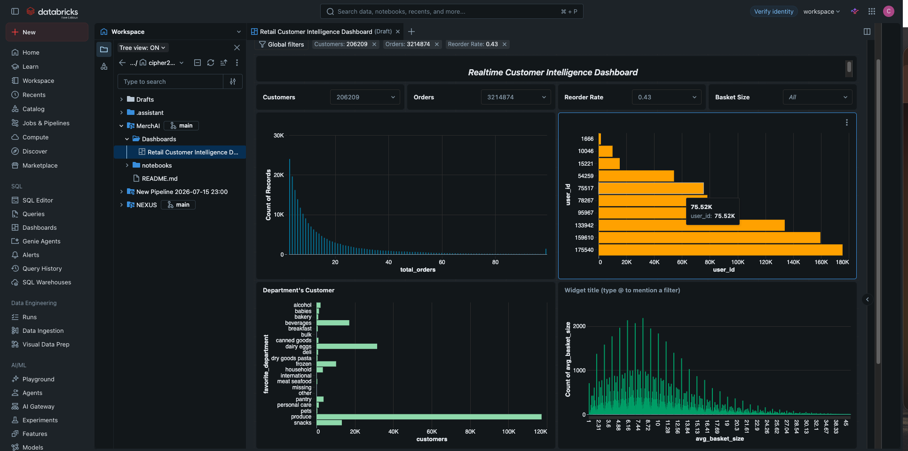

# MerchAI

**MerchAI** is a retail data engineering project built on **Databricks** using the **Medallion Architecture**. It transforms raw retail data into clean, validated, and business-ready datasets through a structured **Bronze → Silver → Gold** pipeline.

The project uses **PySpark, Delta Lake, and SQL** to perform data ingestion, transformation, cleaning, and aggregation, creating a reliable foundation for downstream analytics and business intelligence.

---

## Architecture

```text
                    ┌─────────────────────┐
                    │    Raw Retail Data  │
                    └──────────┬──────────┘
                               │
                               ▼
                    ┌─────────────────────┐
                    │   🥉 Bronze Layer   │
                    │                     │
                    │  Raw Data Ingestion │
                    │  Minimal Processing │
                    └──────────┬──────────┘
                               │
                               ▼
                    ┌─────────────────────┐
                    │   🥈 Silver Layer   │
                    │                     │
                    │  Data Cleaning      │
                    │  Transformation     │
                    │  Validation         │
                    └──────────┬──────────┘
                               │
                               ▼
                    ┌─────────────────────┐
                    │    🥇 Gold Layer    │
                    │                     │
                    │  Business-Ready    │
                    │  Analytical Data   │
                    └─────────────────────┘
```


